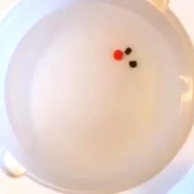
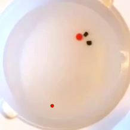
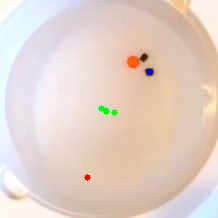
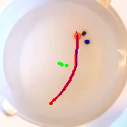

# micro-pathway
A module that creates a path to make space for the gripping dishes.
This code was written based on python 3.8.

## Setup
### 1. Download Code
```sh
cd
mkdir micro_pathway
git clone https://github.com/HJS-HJS/micro-pathway.git ./micro_pathway
```

### 2. Dependencies
```sh
cd ~/micro_pathway
pip install -r requirements.txt    
```

### 3. Import video
Copy the video file you want to create a push path to the [video folder](./video/).

### 4. Set parameters
In addition to the changed video file name, modify various parameters.
```sh
cd ~/micro_pathway/config
gedit config.yaml 
```

## How to Use
### 1. Running code

```sh
cd ~/micro_pathway/scripts
python3 run.py
```
-  Then you can see the following image
<div align="center">

</div>

### 2. Click the goal position
-  Click on the desired goal point in previous image.
-  Once you have made your selection, you can press the _**q button**_ to view the next image.
<div align="center">

</div>

### 3. Click the obstacles position
-  Click on the desired object points in previous image.
-  If you click on multiple points, multiple obstacles will be created.
-  Once you have made your selection, you can press the _**q button**_ to view the next image.
<div align="center">

</div>

### 4. Generate push path
-  Once everything is ready, press the _**q button**_ to create a push path.
-  It may take some time depending on the location of the obstacle.
-  The ${\textsf{\color{red}red path}}$ is the target's path.
-  The ${\textsf{\color{blue}blue path}}$ is the path of the push robot.

<div align="center">

</div>

### 4. Get data
-  You can check the created data in the [path folder](./path/). When you run the code, a path folder will be created.
-  The _**finger**_ file is the path to the pushing robot.
-  The _**target**_ file is the starting and ending position of the push object..
-  All locations were generated based on the pixel coordinates of the video.
